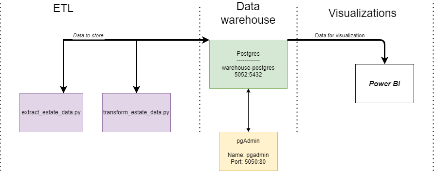

# Statistics of Vietnamese Real Estate.

Statistics of Vietnamese Real Estate.

Processing real estate in HCMC, raw data after scraping from nhatot.vn is put into PostgreSQL, then transform and load into PostgreSQL data warehouse. BI tool for data using Power BI.

## Architecture



## Run

    git clone https://github.com/dleqhuy/vietnamese_real_estate_statistics.git
    cd vietnamese_real_estate_statistics

And finally, we launch all the services:

```sh
docker-compose up
```

After running them, you can crawl the data put into the database. We do this:

```sh
python extract_estate_data.py
```


you can transfrom the data to visualization. We do this:
```sh
python transform_estate_data.py
```
power bi


### Web services

*   [pgAdmin](http://localhost:5050)
*   [Superset](http://localhost:5054)

### Other services available to the host

*   warehouse-postgres: [localhost:5052](\[localhost:5052])

Database address (for pgAdmina): `warehouse-postgres:5432`

Database configuration and pgAdmin:

```text
POSTGRES_USER: postgres
POSTGRES_PASSWORD: postgres
POSTGRES_DB: postgres
PGADMIN_DEFAULT_EMAIL: pgadmin4@pgadmin.org
PGADMIN_DEFAULT_PASSWORD: admin
```


